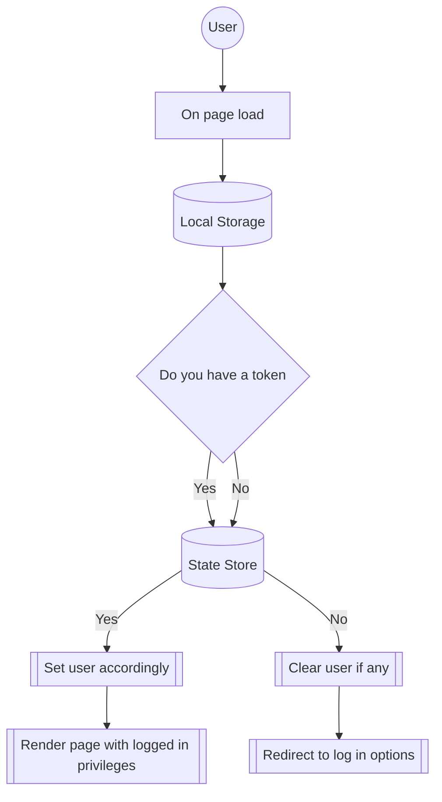
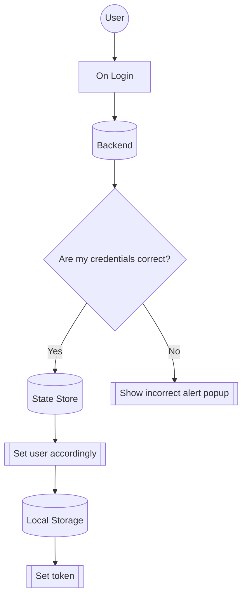

### Flow for pages

- On page load

  - On pages needing no checks (404, forgot password, ...)
    Do nothing.

  - On pages requiring logged out (login)
    Send request for jwt token, if valid, set user details and redirect to home.

  - On pages requiring log in (home)
    Send request for jwt token, if valid, set user details.
    Render content according to role.

### RBAC Table [Pages]

| Action             | Unauthenticated    | Developer            | Module Lead          | Team Lead            |
| ------------------ | ------------------ | -------------------- | -------------------- | -------------------- |
| ForgotPassword     | :white_check_mark: | :white_check_mark:   | :white_check_mark:   | :white_check_mark:   |
| Home (RBAC)        | :x:                | :white_check_mark:   | :white_check_mark:   | :white_check_mark:   |
| Login              | :white_check_mark: | :white_check_mark:\* | :white_check_mark:\* | :white_check_mark:\* |
| 404                | :white_check_mark: | :white_check_mark:   | :white_check_mark:   | :white_check_mark:   |
| Reset Password\*\* | :white_check_mark: | :white_check_mark:   | :white_check_mark:   | :white_check_mark:   |

_\*redirected to home after verifying jwt_

_\*\*redirected if no jwt in url params_

### Diagram for authentication check 
#### Restricted Pages

### Diagram for login

