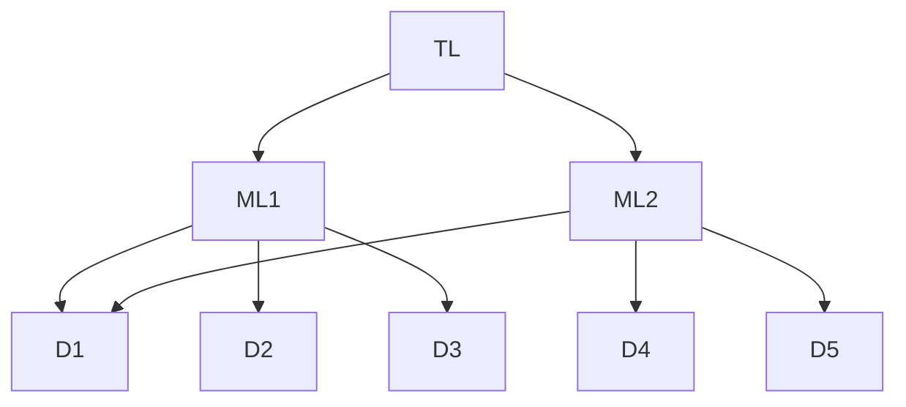
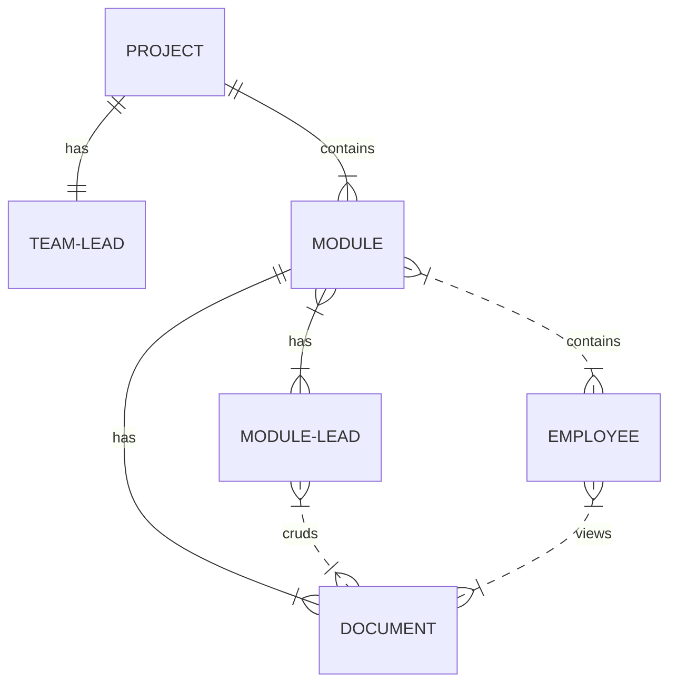

_Last updated 08-February-2023_

## 1.0 Introduction

This is the requirement document for Documentation Management System (DMS) and as such will give a brief idea about the functionality this product will have.  
**Reference - [Confluence](https://www.atlassian.com/software/confluence)**

## 2.0 Brief Requirements [Technical]

| Sr. No. | Requirement                                                               |
| ------- | ------------------------------------------------------------------------- |
| 1       | The system will have email and password authentication and authorization. |
| 2       | The system will have RBAC (described further in section 3.0, 3.1).        |
| 3       | System & User Errors shall be communicated to the user.                   |

## 2.1 Brief Requirements [User Stories]

| Sr. No. | Requirement                                                                                                                                               |
| ------- | --------------------------------------------------------------------------------------------------------------------------------------------------------- |
| 1       | As a developer, I should be able to login to the dms portal using my email & a pre-generated password so that I can access it.                            |
| 2       | As a developer, I can reset/change my password with a mail based OTP/reset link/similar system.                                                           |
| 3       | As a developer, I should be able to see the list of modules that I am a part of their details like number of employees, team lead, modules included, etc. |
| 4       | As a developer I can read the documentation I am a part of.                                                                                               |
| 5       | As a module lead, I want to allow access to my module to enployees.                                                                                       |
| 6       | As a module lead, I want to create, edit and delete module-related documentation modules.                                                                 |
| 7       | As a module lead, I can view my team and their details.                                                                                                   |
| 8       | As a team lead, I want to create, edit and delete modules for my project.                                                                                 |
| 9       | As a team lead, I can assign upto one employee per module as module lead.                                                                                 |
| 10      | As a team lead, I want to be able to change the assigned module lead.                                                                                     |
| 11      | As a team lead, I can pull up the profile of any employees under me containing name, email and other details.                                             |
| 12      | As a team lead, I want to create tags for my modules.                                                                                                     |

## 3.0 Roles

**Graph of how roles will work**

The roles involved in the system are outlined below
Sr. No. | Role
------------- | -------------
1 | Unauthenticated (U)
2 | Developer (D)
3 | Module Lead (ML)
4 | Team Lead (TL)

## 3.1 RBAC Table [Actions]

There are several actions a user may perform in the system according to the role they have, they are outlined below

| Action             | Unauthenticated    | Developer               | Module Lead             | Team Lead          |
| ------------------ | ------------------ | ----------------------- | ----------------------- | ------------------ |
| Login              | :white_check_mark: | :white_check_mark:      | :white_check_mark:      | :white_check_mark: |
| View All Employees | :x:                | :x:                     | :x:                     | :white_check_mark: |
| Create Module      | :x:                | :x:                     | :x:                     | :white_check_mark: |
| Create Tags        | :x:                | :x:                     | :white_check_mark:      | :white_check_mark: |
| Read Module        | :x:                | Only if added to module | Only if added to module | :white_check_mark: |
| Edit Module        | :x:                | :x:                     | Only if module lead     | :white_check_mark: |
| Delete Module      | :x:                | :x:                     | :x:                     | :white_check_mark: |
| Update Module Lead | :x:                | :x:                     | :x:                     | :white_check_mark: |

## 4.1 ER Diagram

_\*This diagram is extremely preliminary and is subject to changes._
